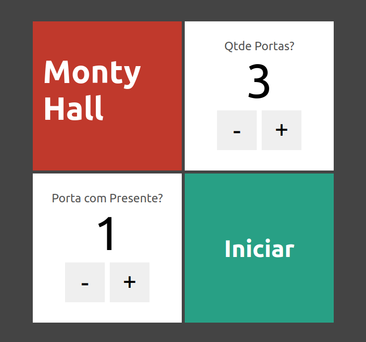
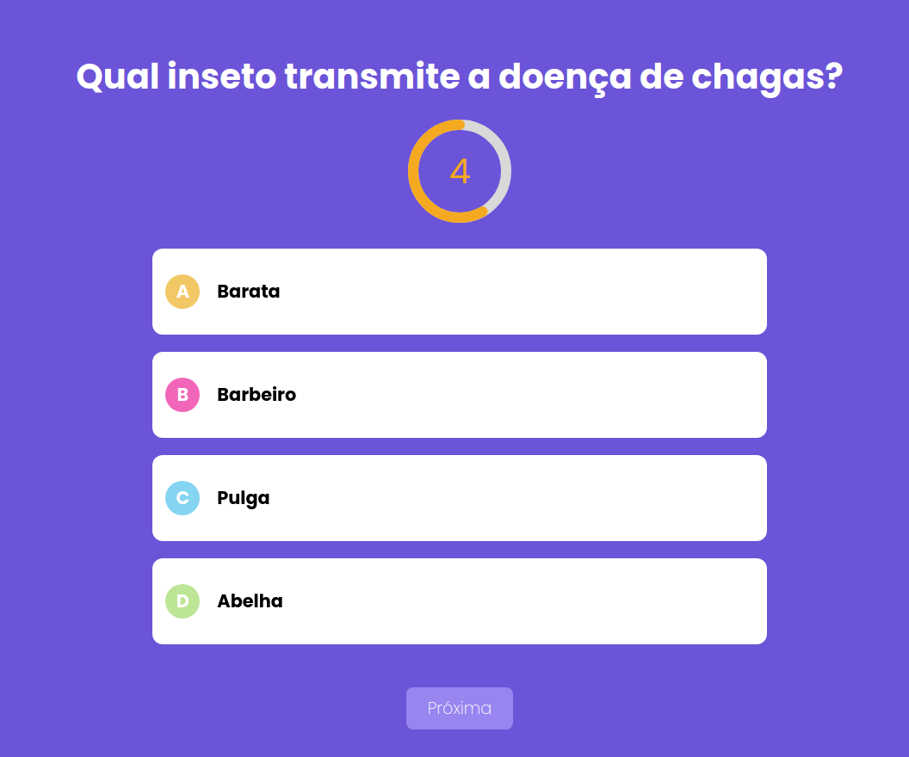

# Nextjs & React - Cod3r

Curso de Nextjs & React da Cod3r. 

https://www.udemy.com/course/nextjs-e-react

## Projetos desenvolvidos

### Monty Hall

Projeto porta premiada.

  

Acessar:
[montyhall-eltonsantos.vercel.app](montyhall-eltonsantos.vercel.app)

### Quiz

Projeto quiz.

  

Acessar:
[quiz-eltonsantos.vercel.app](quiz-eltonsantos.vercel.app)

## 👨🏻‍💻 Author

<h3 align="center">
  
   
  <strong>Elton Santos</strong> 🚀
   
   

 

  

 

Made with ❤️ by Elton Santos 👋🏽 [Entre em contato!](https://www.linkedin.com/in/eltonmelosantos/)

</h3>